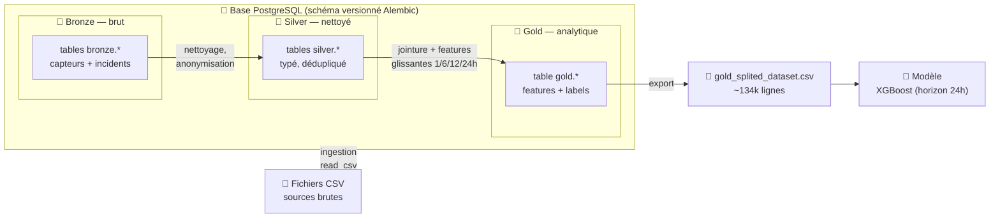

# Model Card for Indusense — Maintenance prédictive (ML tabulaire)

<!-- Provide a quick summary of what the model is/does. -->

Classifieur tabulaire qui estime la probabilité de panne d'une machine dans les prochaines 24 h à partir de features de télémétrie (capteurs, compteurs d'usage, historique d'incidents). Baselines régression logistique / Random Forest, modèle retenu XGBoost.

## Model Details

### Model Description

<!-- Provide a longer summary of what this model is. -->

Modèle de classification binaire (panne / pas de panne à l'horizon 24 h). Trois familles évaluées : régression logistique (baseline), Random Forest et XGBoost. Sélection sur PR-AUC en validation temporelle (TimeSeriesSplit, sans fuite), hyperparamètres tunés avec Optuna (sampler TPE, budget borné, pruning). Suivi complet MLflow, empreinte carbone mesurée avec CodeCarbon.

- **Developed by:** Équipe formation IA — Openium
- **Funded by [optional]:** [More Information Needed]
- **Shared by [optional]:** [More Information Needed]
- **Model type:** Classification binaire tabulaire (gradient boosting)
- **Language(s) (NLP):** Français (documentation) — données numériques de télémétrie
- **License:** mit
- **Finetuned from model [optional]:** N/A (entraîné from scratch)

### Model Sources [optional]

<!-- Provide the basic links for the model. -->

- **Repository:** Dépôt interne formation-ia-project
- **Paper [optional]:** [More Information Needed]
- **Demo [optional]:** [More Information Needed]

## Uses

<!-- Address questions around how the model is intended to be used, including the foreseeable users of the model and those affected by the model. -->

### Direct Use

<!-- This section is for the model use without fine-tuning or plugging into a larger ecosystem/app. -->

Aide à la décision pour la planification de maintenance : hiérarchiser les machines à inspecter en priorité. La sortie est une **probabilité**, à lire comme un signal d'alerte, pas comme un verdict.

### Downstream Use [optional]

<!-- This section is for the model use when fine-tuned for a task, or when plugged into a larger ecosystem/app -->

Intégration dans un tableau de bord de supervision ou déclenchement d'une règle métier (ex. créer un ticket d'inspection au-delà d'un seuil de probabilité choisi avec les équipes terrain).

### Out-of-Scope Use

<!-- This section addresses misuse, malicious use, and uses that the model will not work well for. -->

**Aucune décision automatique** d'arrêt machine ou de sécurité sans validation humaine. Le signal des features est faible (PR-AUC ≈ 0.6) : ne pas utiliser comme unique source de vérité ni pour des garanties contractuelles.

## Bias, Risks, and Limitations

<!-- This section is meant to convey both technical and sociotechnical limitations. -->

Signal prédictif faible sur ce jeu : les features disponibles sont peu déterminantes. Classes déséquilibrées (pannes rares) → risque de faux négatifs. Le modèle apprend des corrélations historiques, pas des causes ; un changement de parc machine ou de régime d'usage dégrade les performances (drift).

### Recommendations

<!-- This section is meant to convey recommendations with respect to the bias, risk, and technical limitations. -->

Garder l'humain dans la boucle. Surveiller le drift et ré-entraîner périodiquement. Choisir le seuil de décision avec le métier selon le coût relatif faux positif / faux négatif. Utiliser SHAP pour vérifier que les features qui pèsent sont cohérentes métier.

## How to Get Started with the Model

Use the code below to get started with the model.

[More Information Needed]

## Training Details

### Training Data

<!-- This should link to a Dataset Card, perhaps with a short stub of information on what the training data is all about as well as documentation related to data pre-processing or additional filtering. -->

**Dataset Gold interne** : `artifacts/ingestions/gold/gold_splited_dataset.csv` (≈ 134 280 lignes, une par fenêtre machine × heure). Construit par un pipeline **Bronze → Silver → Gold** à partir de deux sources Silver : `silver_telemetry.csv` (relevés capteurs : température, pression, tension, rotation, pièces produites) et `silver_incidents.csv` (historique d'incidents typés et sévérité). Features dérivées par fenêtres glissantes 1 h / 6 h / 12 h / 24 h (moyennes, max, écarts-types, tendances, z-scores, deltas) plus compteurs d'incidents et de maintenance passés. Cible = `label_failure_next_24h`. La colonne `split_set` porte le découpage train/val/test **temporel** (pas de mélange futur/passé).

### Training Procedure

<!-- This relates heavily to the Technical Specifications. Content here should link to that section when it is relevant to the training procedure. -->

#### Preprocessing [optional]

Agrégation temporelle, standardisation des baselines linéaires, gestion du déséquilibre via scale_pos_weight (XGBoost).

#### Training Hyperparameters

- **Training regime:** fp32 <!--fp32, fp16 mixed precision, bf16 mixed precision, bf16 non-mixed precision, fp16 non-mixed precision, fp8 mixed precision -->

#### Speeds, Sizes, Times [optional]

<!-- This section provides information about throughput, start/end time, checkpoint size if relevant, etc. -->

Recherche Optuna XGBoost ≈ 107 s / 0.00182 kWh / 0.102 gCO₂eq (voir emissions.csv, mesure CodeCarbon).

## Evaluation

<!-- This section describes the evaluation protocols and provides the results. -->

### Testing Data, Factors & Metrics

#### Testing Data

<!-- This should link to a Dataset Card if possible. -->

Partition `split_set == 'test'` du dataset Gold (`gold_splited_dataset.csv`), fenêtre temporelle tenue à l'écart (out-of-time).

#### Factors

<!-- These are the things the evaluation is disaggregating by, e.g., subpopulations or domains. -->

Horizon 24 h, classe minoritaire = panne.

#### Metrics

<!-- These are the evaluation metrics being used, ideally with a description of why. -->

PR-AUC (métrique de référence, robuste au déséquilibre) et recall. Résultats test : XGBoost PR-AUC ≈ 0.56 · Random Forest ≈ 0.60 · Régression logistique ≈ 0.49.

### Results

Meilleure PR-AUC : Random Forest ≈ 0.60, XGBoost ≈ 0.56, baseline logistique ≈ 0.49. Écarts faibles : le gain du tuning reste marginal, cohérent avec un signal de features peu déterminant.

#### Summary

Sur ce jeu, aucun modèle n'atteint une performance forte. Recommandation v1 : XGBoost (bon compromis interprétabilité SHAP / coût / performance), en aide à la décision uniquement, seuil à caler avec le métier.

## Model Examination [optional]

<!-- Relevant interpretability work for the model goes here -->

Explicabilité SHAP (TreeExplainer) : summary plot global + waterfall local. Permet de vérifier la cohérence métier des features qui pèsent.

## Environmental Impact

<!-- Total emissions (in grams of CO2eq) and additional considerations, such as electricity usage, go here. Edit the suggested text below accordingly -->

Carbon emissions can be estimated using the [Machine Learning Impact calculator](https://mlco2.github.io/impact#compute) presented in [Lacoste et al. (2019)](https://arxiv.org/abs/1910.09700).

- **Hardware Type:** CPU (poste de développement)
- **Hours used:** ≈ 0.03 h (search Optuna 40 essais)
- **Cloud Provider:** Local / on-premise
- **Compute Region:** N/A (on-premise)
- **Carbon Emitted:** ≈ 0.10 gCO₂eq pour la recherche XGBoost (CodeCarbon, emissions.csv)

## Technical Specifications [optional]

### Model Architecture and Objective

Gradient boosting d'arbres (XGBoost) pour classification binaire. Objectif : maximiser la PR-AUC sur la classe minoritaire (panne) sous validation temporelle. Baselines comparées : régression logistique, Random Forest.

### Compute Infrastructure

Poste de développement (CPU), suivi MLflow backend SQLite.

#### Hardware

CPU standard suffisant (inférence légère).

#### Software

Python, XGBoost, scikit-learn, Optuna, MLflow, CodeCarbon, SHAP.

## Citation [optional]

<!-- If there is a paper or blog post introducing the model, the APA and Bibtex information for that should go in this section. -->

**BibTeX:**

N/A (modèle interne de formation).

**APA:**

[More Information Needed]

## Glossary [optional]

<!-- If relevant, include terms and calculations in this section that can help readers understand the model or model card. -->

[More Information Needed]

## More Information [optional]

### Pipeline de données (architecture médaillon Bronze → Silver → Gold)

Les données sont d'abord **ingérées depuis des fichiers CSV** puis chargées dans une base **PostgreSQL** (via SQLAlchemy, schéma versionné par Alembic), où elles transitent par trois couches successives. Des **exports CSV** sont produits dans `artifacts/ingestions/` pour l'entraînement et la traçabilité.

| Couche | Contenu | Emplacement (PostgreSQL / export CSV) | Rôle |
|---|---|---|---|
| **Bronze** | Données brutes ingérées telles quelles (relevés capteurs, incidents anonymisés horodatés) | tables `bronze.*` — export `artifacts/ingestions/incidents/…` | Capturer la donnée source sans transformation (traçabilité, rejouabilité) |
| **Silver** | Données nettoyées, typées et standardisées | tables `silver.*` — export `silver_telemetry.csv`, `silver_incidents.csv` | Uniformiser schémas, corriger les types, dédupliquer, anonymiser |
| **Gold** | Table analytique prête à l'entraînement | table `gold.*` — export `gold_splited_dataset.csv` | Feature engineering (fenêtres glissantes), libellés de panne, split temporel |

**CSV → PostgreSQL (Bronze)** : ingestion des fichiers sources bruts (`read_csv` → `to_sql`) dans les tables Bronze, sans transformation.

**Bronze → Silver** : parsing, typage, nettoyage et anonymisation des relevés de télémétrie et des incidents.

**Silver → Gold** : jointure télémétrie × incidents par machine et fenêtre temporelle, dérivation des features (moyennes / max / std / tendances / z-scores / deltas sur 1 h, 6 h, 12 h, 24 h), compteurs d'incidents et de maintenance passés, création des cibles `label_failure_next_{6,12,24,48}h` et de la colonne `split_set` (découpage train/val/test **temporel**, sans fuite futur→passé).

Chaque couche est reconstructible à partir de la précédente (notebooks `sql-dataset-{bronze,silver,gold}.ipynb`), garantissant la reproductibilité de bout en bout jusqu'au modèle.

## Model Card Authors [optional]

Équipe formation IA — Openium

## Model Card Contact

a.vallet@openium.fr