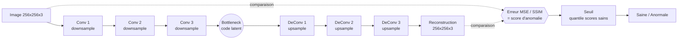
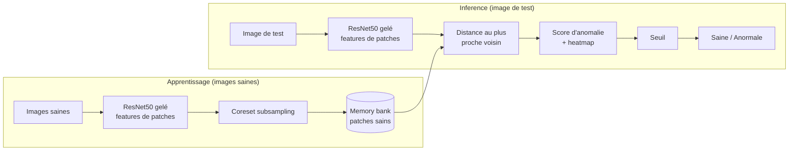

# Model Card for Indusense — Détection d'anomalies visuelles (DL / vision)

<!-- Provide a quick summary of what the model is/does. -->

Détection d'anomalies non supervisée sur images industrielles (catégorie hazelnut du dataset MVTec AD). Deux approches : auto-encodeur convolutif (erreur de reconstruction) et PatchCore (memory bank sur features ResNet50). Modèle retenu : PatchCore.

## Model Details

### Model Description

<!-- Provide a longer summary of what this model is. -->

Le modèle apprend l'apparence des pièces **saines** puis signale tout écart. Auto-encodeur convolutif (3 conv / 3 déconv, pertes MSE/SSIM) → score = erreur de reconstruction ; et PatchCore → distance aux patches sains stockés dans une memory bank (backbone ResNet50 pré-entraîné). Seuil calé sur la distribution des scores sains, AUROC et heatmaps de localisation à l'appui. Suivi MLflow, empreinte CodeCarbon.

- **Developed by:** Équipe formation IA — Openium
- **Funded by [optional]:** [More Information Needed]
- **Shared by [optional]:** [More Information Needed]
- **Model type:** Détection d'anomalies non supervisée (vision)
- **Language(s) (NLP):** Images (MVTec AD, catégorie hazelnut)
- **License:** mit
- **Finetuned from model [optional]:** Backbone ResNet50 pré-entraîné ImageNet (PatchCore, features gelées)

### Model Sources [optional]

<!-- Provide the basic links for the model. -->

- **Repository:** Dépôt interne formation-ia-project
- **Paper [optional]:** [More Information Needed]
- **Demo [optional]:** [More Information Needed]

## Uses

<!-- Address questions around how the model is intended to be used, including the foreseeable users of the model and those affected by the model. -->

### Direct Use

<!-- This section is for the model use without fine-tuning or plugging into a larger ecosystem/app. -->

Contrôle qualité visuel : signaler les pièces potentiellement défectueuses et localiser la zone suspecte (heatmap) pour revue humaine.

### Downstream Use [optional]

<!-- This section is for the model use when fine-tuned for a task, or when plugged into a larger ecosystem/app -->

Pré-tri sur ligne de production : router les pièces à score élevé vers une inspection manuelle, réduire le volume à contrôler à 100 %.

### Out-of-Scope Use

<!-- This section addresses misuse, malicious use, and uses that the model will not work well for. -->

**Pas de rejet automatique** de pièces sans validation. Entraîné sur une seule catégorie/éclairage : ne pas transposer tel quel à d'autres pièces, caméras ou conditions d'éclairage sans ré-entraînement.

## Bias, Risks, and Limitations

<!-- This section is meant to convey both technical and sociotechnical limitations. -->

Modèle non supervisé calé sur des pièces saines : sensible au domaine (éclairage, cadrage, fond). Le seuil arbitre faux positifs vs faux négatifs ; un défaut jamais vu à l'entraînement peut passer si son apparence reste proche du sain. Jeu de test petit (dataset MVTec).

### Recommendations

<!-- This section is meant to convey recommendations with respect to the bias, risk, and technical limitations. -->

Fixer le seuil avec le métier selon le coût d'un défaut manqué. Contrôler la stabilité de l'éclairage/cadrage en production. Revalider si les conditions d'acquisition changent. Conserver une inspection humaine sur les cas limites.

## How to Get Started with the Model

Use the code below to get started with the model.

[More Information Needed]

## Training Details

### Training Data

<!-- This should link to a Dataset Card, perhaps with a short stub of information on what the training data is all about as well as documentation related to data pre-processing or additional filtering. -->

MVTec AD — catégorie hazelnut. Entraînement sur images **saines** uniquement (paradigme one-class). Normalisation + augmentation Albumentations.

### Training Procedure

<!-- This relates heavily to the Technical Specifications. Content here should link to that section when it is relevant to the training procedure. -->

#### Preprocessing [optional]

Redimensionnement (256 px), normalisation, augmentations (auto-encodeur). PatchCore : features ResNet50 gelées, sous-échantillonnage de la memory bank.

#### Training Hyperparameters

- **Training regime:** fp32 <!--fp32, fp16 mixed precision, bf16 mixed precision, bf16 non-mixed precision, fp16 non-mixed precision, fp8 mixed precision -->

#### Speeds, Sizes, Times [optional]

<!-- This section provides information about throughput, start/end time, checkpoint size if relevant, etc. -->

Entraînement auto-encodeur sur CPU/GPU de poste ; PatchCore sans back-prop (extraction de features + coreset). Empreinte suivie via CodeCarbon.

## Evaluation

<!-- This section describes the evaluation protocols and provides the results. -->

### Testing Data, Factors & Metrics

#### Testing Data

<!-- This should link to a Dataset Card if possible. -->

Split de test MVTec hazelnut (pièces saines + défectueuses).

#### Factors

<!-- These are the things the evaluation is disaggregating by, e.g., subpopulations or domains. -->

Détection au niveau image (score d'anomalie).

#### Metrics

<!-- These are the evaluation metrics being used, ideally with a description of why. -->

AUROC (niveau image) — insensible au choix du seuil. Seuil final = quantile de la distribution des scores sains, reporté avec la matrice de confusion.

### Results

AUROC (test) : **PatchCore ≈ 0.986** · auto-encodeur convolutif tuné (Optuna) ≈ 0.927 en validation, ≈ 0.83–0.86 en test. PatchCore nettement supérieur.

#### Summary

Recommandation v1 : **PatchCore** (AUROC ≈ 0.986, localisation par heatmap, pas d'entraînement lourd). L'auto-encodeur reste une baseline pédagogique utile.

## Model Examination [optional]

<!-- Relevant interpretability work for the model goes here -->

Heatmaps de localisation d'anomalie (patchcore_heatmaps.png), histogramme des scores et seuil (threshold_hist.png).

## Environmental Impact

<!-- Total emissions (in grams of CO2eq) and additional considerations, such as electricity usage, go here. Edit the suggested text below accordingly -->

Carbon emissions can be estimated using the [Machine Learning Impact calculator](https://mlco2.github.io/impact#compute) presented in [Lacoste et al. (2019)](https://arxiv.org/abs/1910.09700).

- **Hardware Type:** CPU/GPU de poste de développement
- **Hours used:** Faible (PatchCore sans entraînement ; auto-encodeur quelques epochs)
- **Cloud Provider:** Local / on-premise
- **Compute Region:** N/A (on-premise)
- **Carbon Emitted:** Suivi via CodeCarbon (voir emissions.csv / runs MLflow)

## Technical Specifications [optional]

### Model Architecture and Objective

Deux architectures évaluées, toutes deux en paradigme **one-class** (apprentissage sur pièces **saines** uniquement, détection de tout écart).

#### 1. Auto-encodeur convolutif (baseline)

L'image est compressée puis reconstruite ; une pièce défectueuse se reconstruit mal → l'erreur de reconstruction sert de score d'anomalie.

#### 2. PatchCore (modèle retenu)

Pas d'entraînement par rétro-propagation : on extrait des features de patches avec un **ResNet50 gelé** (pré-entraîné ImageNet), on stocke un sous-échantillon (coreset) des patches **sains** dans une *memory bank*, et le score d'une image de test est la distance au plus proche patch sain — ce qui donne aussi une **heatmap** de localisation.

**Objectif** : maximiser l'AUROC de détection au niveau image. Résultat : PatchCore (AUROC ≈ 0.986) surpasse nettement l'auto-encodeur.

### Compute Infrastructure

Poste de développement (CPU/GPU), suivi MLflow backend SQLite.

#### Hardware

GPU recommandé pour l'extraction de features à l'échelle ; CPU possible sur petits volumes.

#### Software

Python, PyTorch, Albumentations, scikit-learn, MLflow, CodeCarbon.

## Citation [optional]

<!-- If there is a paper or blog post introducing the model, the APA and Bibtex information for that should go in this section. -->

**BibTeX:**

@inproceedings{roth2022patchcore, title={Towards Total Recall in Industrial Anomaly Detection}, author={Roth et al.}, booktitle={CVPR}, year={2022}}

**APA:**

[More Information Needed]

## Glossary [optional]

<!-- If relevant, include terms and calculations in this section that can help readers understand the model or model card. -->

[More Information Needed]

## More Information [optional]

[More Information Needed]

## Model Card Authors [optional]

Équipe formation IA — Openium

## Model Card Contact

a.vallet@openium.fr